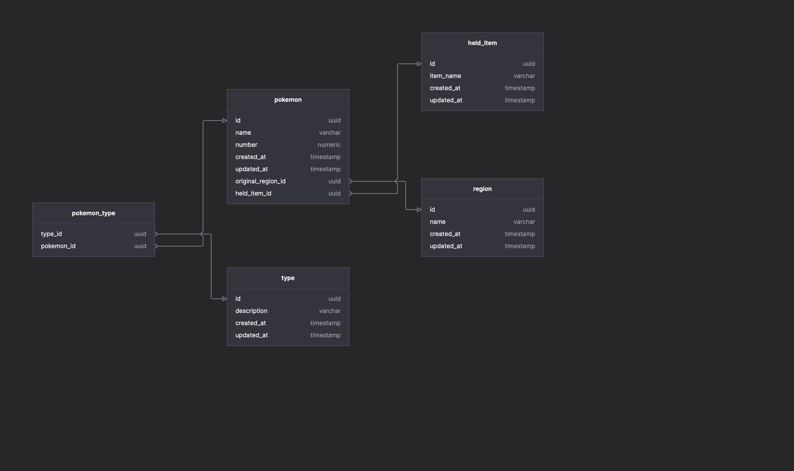

# Sample Nest App

<p align="center">
  <a href="https://github.com/danielvfo/sample-nest-app" target="blank"></a>
</p>

This project was made possible thanks to [Nest](https://github.com/nestjs/nest) framework TypeScript starter repository.
This project was made possible thanks to [TypeORM](https://github.com/typeorm/typeorm).

## Description

This is a simple Nest.js project with some TypeORM entities featuring Many To Many, Many To One, One To One relations and Fixtures. It uses some fictional Pokemon® concepts to implement these relations. Database is PostgreSQL. Feel free to use it.

## Install and run

```bash
$ npm i

$ docker-compose up -d

$ npm run typeorm:migration:run

$ npm run fixtures

$ npm run start:dev
```
And then you can call http://localhost:3000/type/Grass from your browser

## License

Under [MIT licensed](LICENSE).
